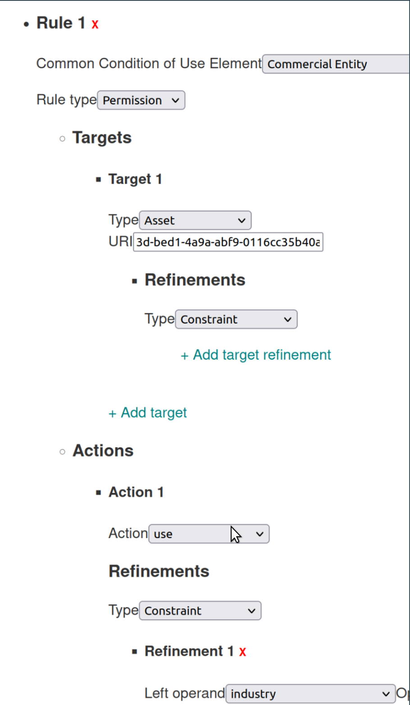
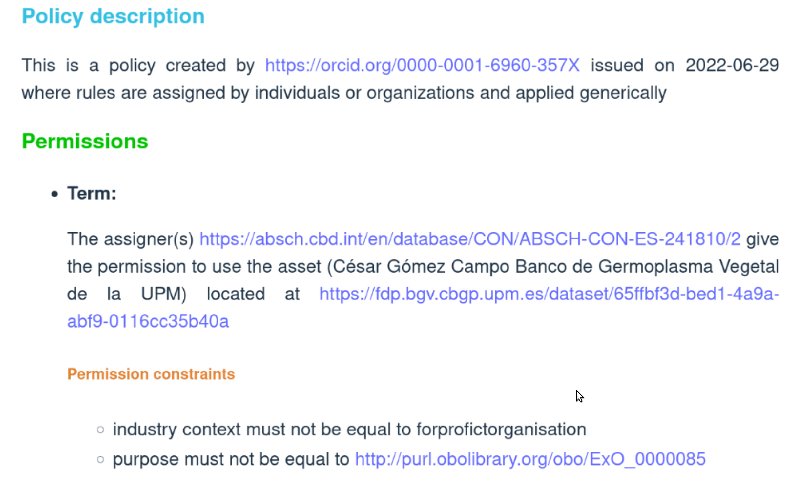

# Background

With the adoption of the FAIR principles [@Wilkinson2016], there is an increasing need to facilitate automated exploration of access to global resources. The Open Digital Rights Language (ODRL)[@ianella2007open] provides a possible entry-point for machine-to-machine negotiation of access, based on the consent or governing regulations associated with a resource

ODRL is a Vocabulary and Information Model - represented in the OWL ontology language - for authoring rights, requests, and agreements around access to, and use of, resources. Though originally designed for digital objects such as music and video, its architecture offers the oppoertunity to represent access constraints and usage conditions for a wide range of resources - both digital and physical - including, for example, patient consent [@esteves2021odrl]. ODRL represents the core types of entities that appear in the discourse around digital rights, including policies, actors/parties, actions, rules, and assets.  The Information Model captures the complex relationships between these entities, allowing rights and obligations to be applied to various assets, or parts of assets, and offered to various parties under specified conditions.  The key to ODRL is its "Constraint" class, that allows conditions to be specified that narrow the scopre of any of the entities involved - e.g. to a subset of actors, or a limit on the duration or frequenty of usage of the digital asset. Constraints are represented as a triplet of [leftOperand, operator, rightOperand], each of which has a unique symbol in the Vocabulary. Agents consuming the Constraints must be capable of understanding the semantics of each symbol (which is defined primarily through narrative text) in order to interpret the Policy document.  ODRL is thus easily extended into new domains, simply by extending the set of symbols into those thaqt represent the kinds of restrictions and comditionals that exist in that new domain.

ODRL became a W3 recommendation in 2018, though its adoption by the bioinformatics community has been modest. This could be explained entirely by its novelty - 5 years is seldom enough time for a novel technology to see broad uptake, and the adoption of this technology within the small, specialist community of data resource providers bears the hallmarks of its adoption being in the "innovators" phase of technology diffusion [@rogers1983diffusion] [@denis2002explaining]. This phase is associated with experimentation to test if the new technology provides a notable advantage over a status quo, trial and error, cost/benefit analyses, and especially a focus on reducing the cost through improved tooling.  At BioHackathon 2023, we have focused on two activities:  1) tooling, to facilitate others in their adoption and understanding of the technology, and 2) experimentation through applying the technology to a novel domain; i.e., representation of the "benefit-sharing" constraints and regulations defined by international treaties governing access to germplasm (seeds).

_Tooling_ ODRL documents represent a complex network of interactions between actors and the resources they have/want. They are complex to author, and their representational syntaxes adn symbols are aimed at the computational agent as the primary consumer. While this does allow a high degree of precision and granularity in constructing the Policy ruleset, the more explicit the policy the more complex the document, and thus the more difficult it becomes for the Policy to be comprehensible a human consumer. We addressed this by creating two authoring environments - one Web-based, and the other as a set of Ruby libraries.  In addition, we continued work on a visualization environment for ODRL Policy documents which converts the machine-readable syntax into narrative sentences in English, and formats them into a relatively clear set of policy statements. Given that, particularly for consent, the objective is to achieve "_informed_ consent", the accurate translation of these policy documents into a form that is easily digested and understood by non-expert patients is critical to the broader uptake of this technology within the biomedical community.

_Experimentation_ While we, and others, have been applying ODRL to the problem of representing patient consent over their own personal data, we are also involved in projects that aim to "FAIRify" the data and metadata related to germplasm databases and access to their seed stocks. Access to germplasm falls under the governance of international treaties - one of which is the Nagoya Protocol [@buck2011nagoya], which places an emphasis on the requirement for benefit sharing when being given access to a seed stock for research or crop-development purposes. Recently, there have also been concerns about "Biopiracy" and the consequences of providing access to the digital representation of germplasms [@rabitz2015biopiracy], including elements such as quantitative trait observations, biochemical profiles or raw sequence. At BioHackathon 2023, we began some trial-and-error explorations of the use of ODRL to represent the core tenets of the Nagoya Protocol, using the specific treaty implementaiton of the Ministerio para la Transición Ecológica y el Reto Demográfico of the Government of Spain.

# Outcomes

### ODRL Ruby Libraries

Figure 1 shows the core elements and relationships within the ODRL Information Model. A set of Ruby objects was created to capture these elements, their inherience patterns, and their allowed relationships.  The code of the resulting objects can be examined via the GitHub repository [ODRL-RUBY](https://github.com/markwilkinson/ODRL-RUBY). A Ruby gem - [odrl-ruby](https://rubygems.org/gems/odrl-ruby) -  was also built, and pushed to the Rubygems public repository.

|  | 
|:--:| 
| *Figure 1: Schematic of the ODRL Information Model, taken from https://www.w3.org/TR/odrl-model/* |

Below is an example of code that uses the gem to create an offer (odrl:Offer) from [Mark Wilkinson](https://orcid.org/0000-0001-6960-357X) to [Toshiaki Katayama](https://orcid.org/0000-0003-2391-0384) giving permission (odrl:Permission) for use (odrl:use) of a resource (a hypothetical database at http://mark.wilkinson.org/data/polyA).  The offer is constrained (odrl:Constraint) to being applicable only for the duration of the biohackathon ("event" "eq" "https://2023.biohackathon.org").


```
require 'odrl/ruby'

policy = ODRL::Offer.new(
    title: "Offer to Toshiaki-san", 
    creator: "https://orcid.org/0000-0001-6960-357X", 
    description: "An offer for Toshiaki-san to use the polyA data during the hackathon",
    subject: "collaboration", # this is the CCE category
)

asset = ODRL::Asset.new(uid: "http://mark.wilkinson.org/data/polyA", 
                        title: "Mark's PolyA Database")

mark = ODRL::Party.new(uid: "https://orcid.org/0000-0001-6960-357X", 
                             predicate: ODRLV.assigner, 
                             title: "Mark D Wilkinson" )
toshiaki = ODRL::Party.new(uid: "https://orcid.org/0000-0003-2391-0384", 
                              predicate: ODRLV.assignee, 
                              title: "Toshiaki Katayama")

# Rules
permission = ODRL::Permission.new(title: "Permission to use")

use = ODRL::Use.new(value: "use") # subclass of action

constraint = ODRL::Constraint.new(
    title: "Only during the hackathon",
    leftOperand: "event",
    operator: "eq",
    rightOperand: "https://2023.biohackathon.org"
)
permission.addConstraint(constraint: constraint)
permission.addAsset(asset: asset)
permission.addAssigner(party: toshiaki)
permission.addAssignee(party: mark)
permission.addAction(action: use)

policy.addPermission(rule: permission)

policy.load_graph
result = policy.serialize(format: 'turtle')
puts result

```
|    |
|:--:| 
| *Figure 2: Code that generates the ODRL Policy document shown in Figure 3* |


Executing this code results in the following ODRL Policy document (in RDF Turtle format):

```
@prefix rdf: <http://www.w3.org/1999/02/22-rdf-syntax-ns#> .

<http://example.org#constraint_68811358965684>
    <http://purl.org/dc/terms/identifier> <http://example.org#constraint_68811358965684> ;
    <http://purl.org/dc/terms/title> "Only during the hackathon"@en ;
    a <http://www.w3.org/ns/odrl/2/Constraint> ;
    <http://www.w3.org/2000/01/rdf-schema#label> "Only during the hackathon"@en ;
    <http://www.w3.org/ns/odrl/2/leftOperand> <http://www.w3.org/ns/odrl/2/event> ;
    <http://www.w3.org/ns/odrl/2/operator> <http://www.w3.org/ns/odrl/2/eq> ;
    <http://www.w3.org/ns/odrl/2/rightOperand> <https://2023.biohackathon.org> ;
    <http://www.w3.org/ns/odrl/2/uid> <http://example.org#constraint_68811358965684> .

<http://example.org#policy_68811358965627>
    <http://purl.org/dc/terms/creator> <https://orcid.org/0000-0001-6960-357X> ;
    <http://purl.org/dc/terms/description> "An offer for Toshiaki-san to use the polyA data during the hackathon"@en ;
    <http://purl.org/dc/terms/identifier> <http://example.org#policy_68811358965627> ;
    <http://purl.org/dc/terms/subject> "collaboration"@en ;
    <http://purl.org/dc/terms/title> "Offer to Toshiaki-san"@en ;
    a <http://www.w3.org/ns/odrl/2/Offer> ;
    <http://www.w3.org/2000/01/rdf-schema#label> "Offer to Toshiaki-san"@en ;
    <http://www.w3.org/ns/odrl/2/permission> <http://example.org#rule_68811358965667> ;
    <http://www.w3.org/ns/odrl/2/uid> <http://example.org#policy_68811358965627> .

<http://example.org#rule_68811358965667>
    <http://purl.org/dc/terms/identifier> <http://example.org#rule_68811358965667> ;
    <http://purl.org/dc/terms/title> "Permission to use"@en ;
    a <http://www.w3.org/ns/odrl/2/Permission> ;
    <http://www.w3.org/2000/01/rdf-schema#label> "Permission to use"@en ;
    <http://www.w3.org/ns/odrl/2/action> <http://www.w3.org/ns/odrl/2/use> ;
    <http://www.w3.org/ns/odrl/2/assignee> <https://orcid.org/0000-0001-6960-357X> ;
    <http://www.w3.org/ns/odrl/2/assigner> <https://orcid.org/0000-0003-2391-0384> ;
    <http://www.w3.org/ns/odrl/2/constraint> <http://example.org#constraint_68811358965684> ;
    <http://www.w3.org/ns/odrl/2/target> <http://mark.wilkinson.org/data/polyA> ;
    <http://www.w3.org/ns/odrl/2/uid> <http://example.org#rule_68811358965667> .

<http://mark.wilkinson.org/data/polyA>
    <http://purl.org/dc/terms/identifier> <http://mark.wilkinson.org/data/polyA> ;
    <http://purl.org/dc/terms/title> "Mark's PolyA Database"@en ;
    a <http://www.w3.org/ns/odrl/2/Asset> ;
    <http://www.w3.org/2000/01/rdf-schema#label> "Mark's PolyA Database"@en ;
    <http://www.w3.org/ns/odrl/2/uid> <http://mark.wilkinson.org/data/polyA> .

<http://www.w3.org/ns/odrl/2/use>
    <http://purl.org/dc/terms/identifier> <http://www.w3.org/ns/odrl/2/use> ;
    a "type"@en ;
    <http://www.w3.org/2000/01/rdf-schema#label> ""@en ;
    <http://www.w3.org/ns/odrl/2/uid> <http://www.w3.org/ns/odrl/2/use> ;
    <https://schema.org/name> ""@en .

<https://orcid.org/0000-0001-6960-357X>
    <http://purl.org/dc/terms/identifier> <https://orcid.org/0000-0001-6960-357X> ;
    <http://purl.org/dc/terms/title> "Mark D Wilkinson"@en ;
    a <http://www.w3.org/ns/odrl/2/Party> ;
    <http://www.w3.org/2000/01/rdf-schema#label> "Mark D Wilkinson"@en ;
    <http://www.w3.org/ns/odrl/2/uid> <https://orcid.org/0000-0001-6960-357X> .

<https://orcid.org/0000-0003-2391-0384>
    <http://purl.org/dc/terms/identifier> <https://orcid.org/0000-0003-2391-0384> ;
    <http://purl.org/dc/terms/title> "Toshiaki Katayama"@en ;
    a <http://www.w3.org/ns/odrl/2/Party> ;
    <http://www.w3.org/2000/01/rdf-schema#label> "Toshiaki Katayama"@en ;
    <http://www.w3.org/ns/odrl/2/uid> <https://orcid.org/0000-0003-2391-0384> .
    
```
|    |
|:--:| 
| *Figure 3: An ODRL Policy document giving Toshiaki Katayama permission to use the PolyA database during the BioHackathon* |


### Web-based Builder

For those who prefer graphical interfaces, we have also created a Web-based building tool that uses drop-down menus and Web form fields, in a visual layout that mirrors the object-relationships in the ODRL Information Model.  This interface is shown in Figure 2.  Unlike the Ruby libraries, the Web tool is coded to simplify the construction of ODRL Policy Rules that mirror the [Common Conditions of Use elements (CCEs)](https://duc.le.ac.uk/) (Gibson et al, submitted).  The CCEs are a set of approximately 20 conditions that appear in a wide range of consent forms worldwide.  Since individual CCEs are constrained in the form and content of the Rule, the resulting Web interface can be simplified for the human author (while lacking the flexibility of the Ruby libraries).  In Fiture 1, the author is choosing to create an ODRL Policy around the use of data for commercial purposes, as seen in the top-most drop-down menu selection.

|  | 
|:--:| 
| *Figure 4: The Web-based ODRL Policy Building tool, showing several of the fields related to the Policy metadata*  |

It should be noted that the Web-based tool does not immediately generate ODRL, but rather an intermediate JSON-formatted document that must then be passed through a CDE-specific set of templates (following the YARRRML [@heyvaert2018declarative] and RML [@dimou2014rml] standards - not described here) prior to becoming a valid ODRL Policy document.

### Web-based Translator

As noted earlier, ODRL documents are meant entirely for the consumption of a computational agent, and are quite opaque for a human reader.  As such, to support comprehension and _informed_ consent, we have also constructed a "translator", which converts ODRL documents into narrative, human readable text.  While this work is ongoing, the current output from the translator is shown in Figure 5.  Being machine-readable, ODRL documents will often lack support for the human reader, such as a label or definition therefore, where possible, the translator attempts to extract a human-readable string from the data (for example, the last field in a URL will often be a "word" indicating the purpose or interpretation of that URL - such as _http://www.w3.org/ns/odrl/2/use_). 

|  | 
|:--:| 
| *Figure 5: The "translation" of an ODRL Policy related to the governance of the use of Germplasm for non-commercial purposes, assigned by the appropriate Spanish government ministry (with identifier ABSCH-CON-ES-241810/2).  The typographical error in "for profit organization" arises, unfortunately, from the source ontology.* |

### ODRL Policy Builder

By design, ODRL is intended to be used as an extension point into novel domains.  The mechanism for ODRL extension is to create a formal document in the OWL language, following some rules defined by the ODRL specification.  We have captured these rules in another library within the odrl-ruby gem, and this allows easy authoring of these extension definitions.  An example of extention code is in Figure 6.  The code adds an extension to every ODRL category that captures a (hypothetical) set of extra concepts required to build Policies around the governance of germplasm stock access, such as the planting/harvesting of the stock, and its degree of risk of extinction.

```
require 'odrl/profile/builder'

p = ODRL::Profile::Builder.new(
    uri: 'https://example.org/myprofiles/germplasm_odrl_profile.ttl',
    title: "ODRL Profile for Germplasm resources",
    description: "There are some properties and comparisons that only make sense in the Germplasm expert domain",
    author: "Mark D Wilkinson",
    profile_class: "https://example.org/myprofiles/ontology#SeedOffer"
)

p.asset_relations << ODRL::Profile::AssetRelation.new( 
    uri: "https://example.org/myprofiles/ontology#nagoya_permission",
    label: "Permission under Nagoya protocol", 
    definition: "Permission is a special thing in the Nagoya protocol")


p.party_functional_roles << ODRL::Profile::AssetRelation.new(  
    uri: "https://example.org/myprofiles/ontology#nagoya_assigner",
    label: "Assigner with Nagoya authority to assign", 
    definition: "Assigners have special responsibilities in the Nagoya protocol")

p.actions << ODRL::Profile::Rule.new( 
    uri: "https://example.org/myprofiles/ontology#nagoya_propogate",
    label: "Plant and Harvest", 
    definition: "the action of planting and harvesting the seed", 
    included_in: ODRLV.use,
    implies: ODRLV.distribute)


p.leftOperands << ODRL::Profile::LeftOperand.new( 
    uri: "https://example.org/myprofiles/ontology#at_risk_species",
    label: "At Risk Species", 
    definition: "A species that has been flagged as at-risk of extinction")

p.rightOperands << ODRL::Profile::RightOperand.new( 
    uri: "https://example.org/myprofiles/ontology#on_watchlist",
    label: "On Watchlist", 
    definition: "A species whose risk of extinction is on a watchlist")

p.rightOperands << ODRL::Profile::Relation.new( 
    uri: "https://example.org/myprofiles/ontology#within_risk_boundary",
    label: "Within Bounds", 
    definition: "comparison of risk boundaries")


p.build()
puts p.serialize

```
|    |
|:--:| 
| *Figure 6: An ODRL Profile document extending the core vocabulary to include concepts relevant to germplasm* |


# Future work

Improve visualization
Improve pipeline for web builder through intermediate steps
Build Germaplsm Profile
Broaden ODRL spec covered by Ruby libraries
Complete negotiator

## Acknowledgements

We would like to thank the fellow participants at BioHackathon 2023 for their collaboration and constructive advice, which greatly influenced our project. MDW is funded via the European Union's Horizon 2020 research and innovation programme under the EJP RD COFUND-EJP No. 825575.  OMB is funded by a fellowship from the Algerian Ministry of Higher Education and Scientific Research.  

## References

1.
