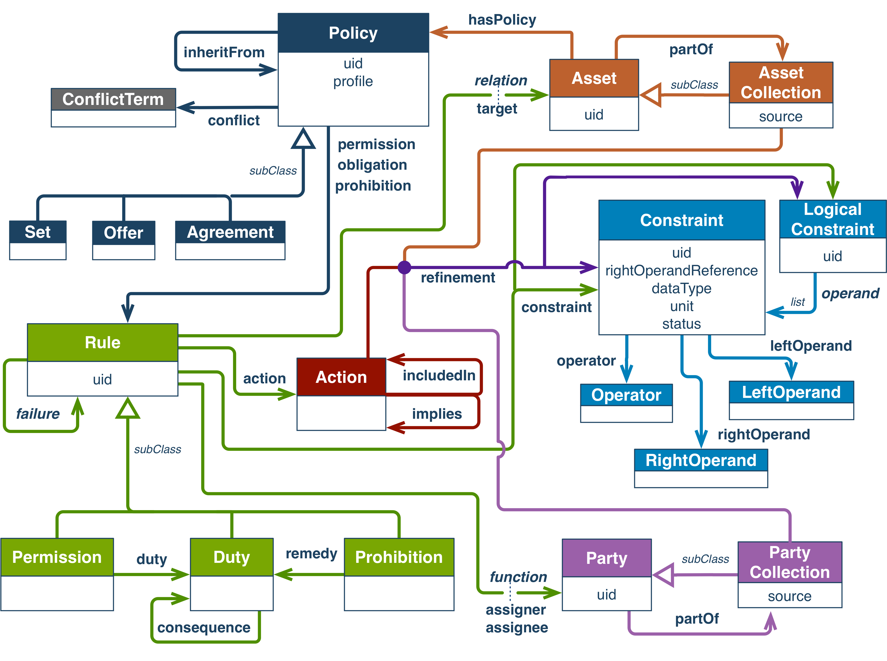

# Background

With the adoption of the FAIR principles [@Wilkinson2016], there is an increasing need to facilitate automated exploration of access to global resources. The Open Digital Rights Language (ODRL)[@ianella2007open] provides a possible entry-point for machine-to-machine negotiation of access, based on the consent or governing regulations associated with a resource

ODRL is a Vocabulary and Information Model - represented in the OWL ontology language - for authoring rights, requests, and agreements around access to, and use of, resources. Though originally designed for digital objects such as music and video, its architecture offers the oppoertunity to represent access constraints and usage conditions for a wide range of resources - both digital and physical - including, for example, patient consent [@esteves2021odrl]. ODRL represents the core types of entities that appear in the discourse around digital rights, including policies, actors/parties, actions, rules, and assets.  The Information Model captures the complex relationships between these entities, allowing rights and obligations to be applied to various assets, or parts of assets, and offered to various parties under specified conditions.  The key to ODRL is its "Constraint" class, that allows conditions to be specified that narrow the scopre of any of the entities involved - e.g. to a subset of actors, or a limit on the duration or frequenty of usage of the digital asset. Constraints are represented as a triplet of [leftOperand, operator, rightOperand], each of which has a unique symbol in the Vocabulary. Agents consuming the Constraints must be capable of understanding the semantics of each symbol (which is defined primarily through narrative text) in order to interpret the Policy document.  ODRL is thus easily extended into new domains, simply by extending the set of symbols into those thaqt represent the kinds of restrictions and comditionals that exist in that new domain.

ODRL became a W3 recommendation in 2018, though its adoption by the bioinformatics community has been modest. This could be explained entirely by its novelty - 5 years is seldom enough time for a novel technology to see broad uptake, and the adoption of this technology within the small, specialist community of data resource providers bears the hallmarks of its adoption being in the "innovators" phase of technology diffusion [@rogers1983diffusion] [@denis2002explaining]. This phase is associated with experimentation to test if the new technology provides a notable advantage over a status quo, trial and error, cost/benefit analyses, and especially a focus on reducing the cost through improved tooling.  At BioHackathon 2023, we have focused on two activities:  1) tooling, to facilitate others in their adoption and understanding of the technology, and 2) experimentation through applying the technology to a novel domain; i.e., representation of the "benefit-sharing" constraints and regulations defined by international treaties governing access to germplasm (seeds).

_Tooling_ ODRL documents represent a complex network of interactions between actors and the resources they have/want. They are complex to author, and their representational syntaxes adn symbols are aimed at the computational agent as the primary consumer. While this does allow a high degree of precision and granularity in constructing the Policy ruleset, the more explicit the policy the more complex the document, and thus the more difficult it becomes for the Policy to be comprehensible a human consumer. We addressed this by creating two authoring environments - one Web-based, and the other as a set of Ruby libraries.  In addition, we continued work on a visualization environment for ODRL Policy documents which converts the machine-readable syntax into narrative sentences in English, and formats them into a relatively clear set of policy statements. Given that, particularly for consent, the objective is to achieve "_informed_ consent", the accurate translation of these policy documents into a form that is easily digested and understood by non-expert patients is critical to the broader uptake of this technology within the biomedical community.

_Experimentation_ While we, and others, have been applying ODRL to the problem of representing patient consent over their own personal data, we are also involved in projects that aim to "FAIRify" the data and metadata related to germplasm databases and access to their seed stocks. Access to germplasm falls under the governance of international treaties - one of which is the Nagoya Protocol [@buck2011nagoya], which places an emphasis on the requirement for benefit sharing when being given access to a seed stock for research or crop-development purposes. Recently, there have also been concerns about "Biopiracy" and the consequences of providing access to the digital representation of germplasms [@rabitz2015biopiracy], including elements such as quantitative trait observations, biochemical profiles or raw sequence. At BioHackathon 2023, we began some trial-and-error explorations of the use of ODRL to represent the core tenets of the Nagoya Protocol, using the specific treaty implementaiton of the Ministerio para la Transición Ecológica y el Reto Demográfico of the Government of Spain.

# Outcomes

# Future work

Improve visualization
Improve pipeline for web builder through intermediate steps
Build Germaplsm Profile
Broaden ODRL spec covered by Ruby libraries
Complete negotiator

## Acknowledgements

We would like to thank the fellow participants at BioHackathon 2023 for their collaboration and constructive advice, which greatly influenced our project. MDW is funded via the European Union's Horizon 2020 research and innovation programme under the EJP RD COFUND-EJP No. 825575.  OMB is funded by a fellowship from the Algerian Ministry of Higher Education and Scientific Research.  

## References

1.
